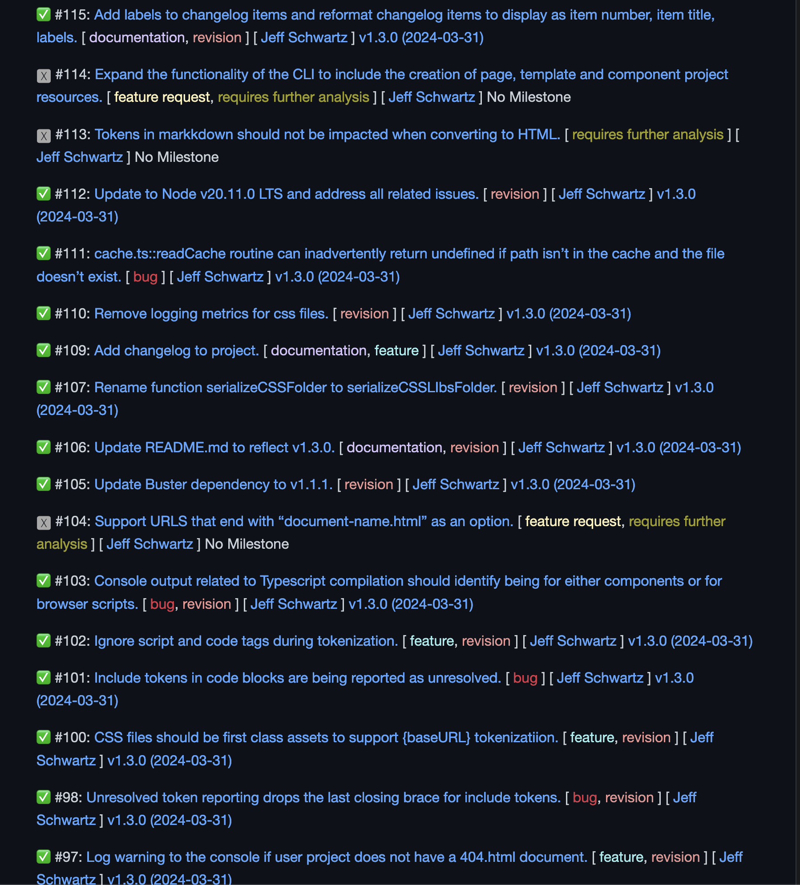

<h1><span style="vertical-align: text-top;">👉&nbsp;</span>snitch</h1>

## A terminal utility for generating attractive interactive GitHub repository issue reports.

⚠️ This project was formerly named _ghif_ but as of v2 has diverged significantly enough from that codebase to warrant a new name and rebranding while maintaining all its previous git history.

<!--  -->
<!-- <br> -->




### 5 Report Types To Chose From

| Report Name | Description | Example |
| :-- | :-- | :-- |
| list | a list of issues | `snitch --name=list > snitch-report.md` |
| milestone | a list of issues by milestone | `snitch --name=milestone > snitch-report.md` |
| milestone-label | a list of issues by milestone and label | `snitch --name=milestone-label > snitch-report.md` |
| label | a list of issues by label | `snitch --name=label > snitch-report.md` | 
| assignee | a list of issues by assignee | `snitch --name=assignee > snitch-report.md` | 

<!-- ⚠️ Reports in both _markdown_ and _text_ are supported. However, please note that interactive reports (reports whose elements provide links back to their respective GitHub repositories) are only supported in markdown. -->

### Options

| Option | Description | Default (if omitted)| Example |
| :-- | :-- | :-- | :-- |
| --repo=[path to repository] | path to Github repository | the GitHub repository associated with the current project determined by git remote origin | `--repo=4awpawz/snitch` |
| --state=[all \| open \| closed] | limit reporting to issues with this state | all | `--state=closed` |
| --max-issues=integer | maximum number of issues to report on | 10000 | `--max-issues=100000` |
| --name=[list \| milestone \| milestone-label \| label \| assignee] | type of report to generate | list | `--name=milestone-label` |
| --heading=[report heading] | the heading for the report | repository name | `--heading=CHANGELOG` |
| --non-interactive | generate non interactive issues | generate interactive issues | `--non-interactive` |
| --debug | run in debug mode, see below for details| run in normal mode | `--debug` |

#### Debug mode

You can run snitch in _debug mode_ to expose the dynamically generated configuration data that would be used during the processing of the payload returned from GitHub's _gh_ utility as well as the command line that would be used to invoke _gh_ itself. This information could be extremely useful when submitting an issue to us or for your own problem resolution.

To invoke debug mode, append `--debug` to the command line that you would use to generate your desired report, such as the list report in the command below:

```shell
> snitch --name=list --state=open --repo=4awpawz/snitch --debug 
```

The output from running snitch in debug mode would look similar to the following:

```shell
debug config:  {
  debug: true,
  repo: 'https://github.com/4awpawz/fusion.ssg',
  state: 'all',
  maxIssues: 10000,
  nonInteractive: false,
  noHeading: false,
  heading: '4awpawz/fusion.ssg',
  reportName: 'list'
}
debug gh command:  gh issue list -L 10000 --state all --json 'number,title,labels,milestone,state,assignees,url' -R https://github.com/4awpawz/fusion.ssg
```

You can also run the _debug gh command_ to examine the JSON payload returned by GitHub's _gh_ utility:

```shell
> gh issue list -L 10000 --state open --json 'number,title,labels,milestone,state,assignees,url' -R https://github.com/4awpawz/snitch
```

### Installation

⚠️ snitch requires both Github's [gh](https://cli.github.com) utility and [Node.js](https://nodejs.org/en).

To install snitch with NPM, please run the following command in your terminal:

```shell
> npm i -g 4awpawz/snitch
```

### Examples

#### Generate a changelog for your project

```shell
> snitch --name=list --state=closed > CHANGELOG.md
```
#### Generate a status report by assignee

```shell
> snitch --name=assignee > status.md
```

### Request a new report format

Have an idea for a report format that is not yet supported? Then by all means please submit a request along with a detailed description of the report you are seeking.

## License

MIT

### Show some love ❤️


If using _snitch_ provides you value then please click on the repository's _Star_ button.

If you would like to be notified when there are changes then please click on the repository's _Watch_ button.
