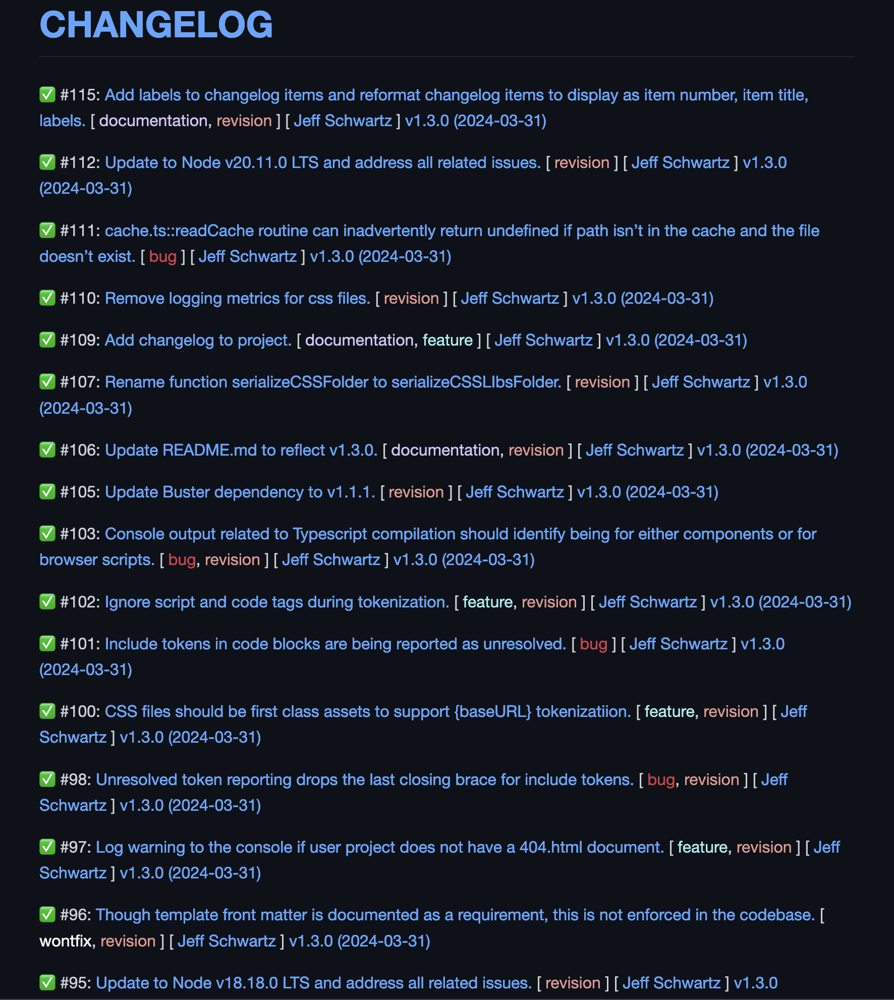
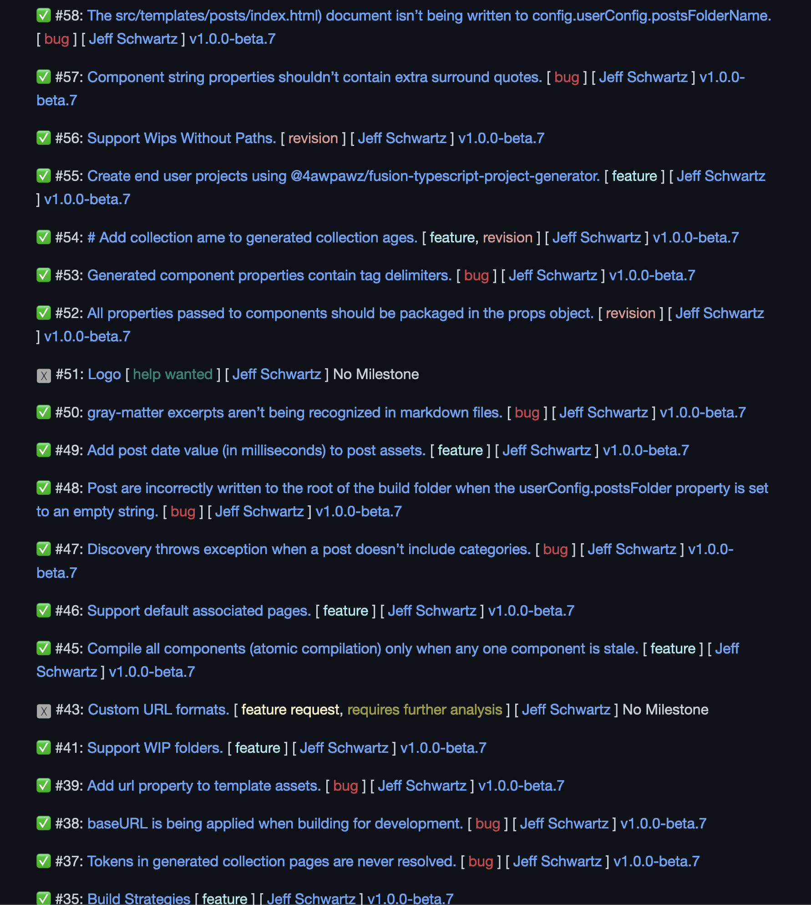
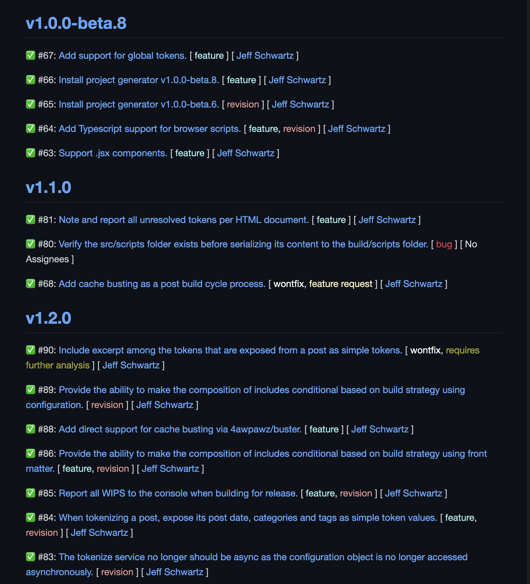
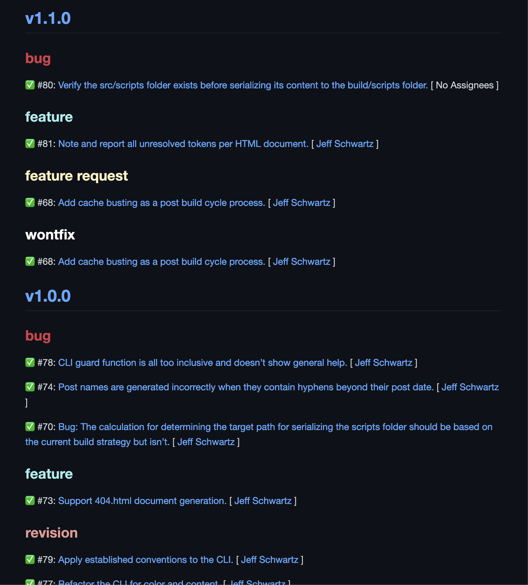
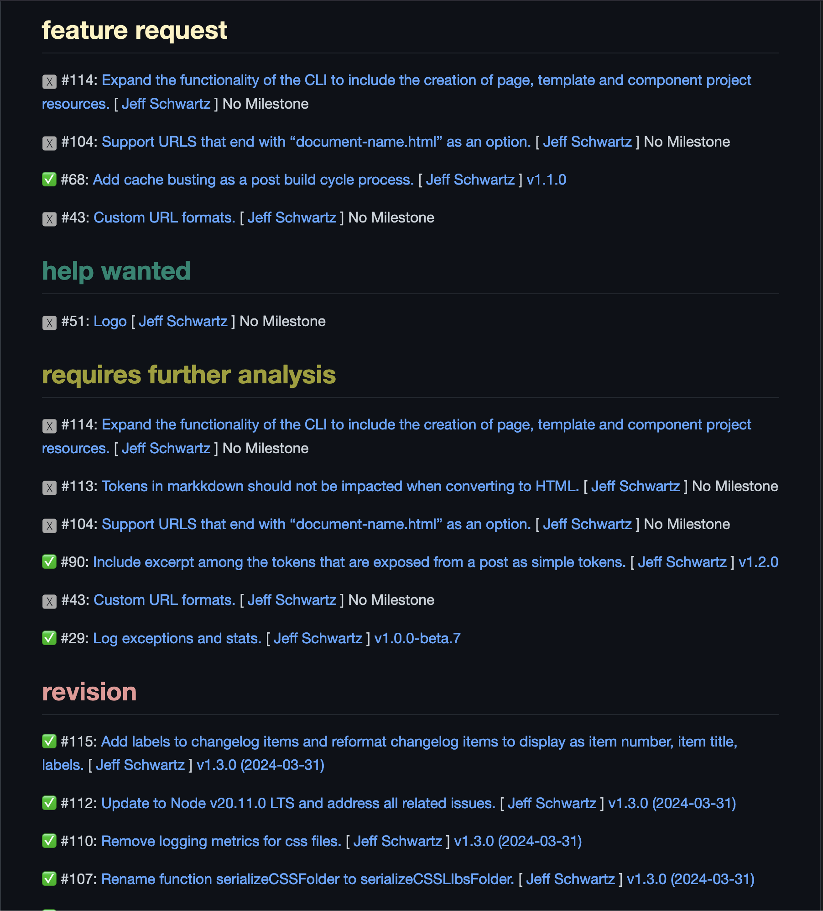
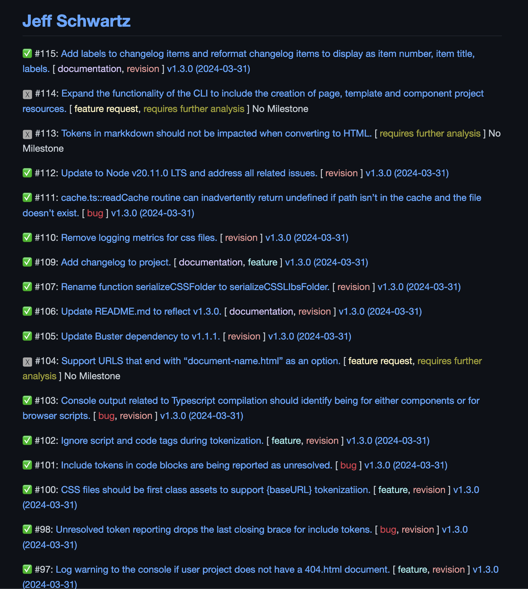

# Snitch 👉


[](https://badge.fury.io/js/@4awpawz%2Fsnitch)
[](https://github.com/picocss/pico/blob/master/LICENSE.md)
[](https://twitter.com/4awpawz)

## Automated GitHub Issues Reporting

Snitch is a terminal utility that automates the creation of interactive and informative reports from a GitHub repository's issues.

[](https://www.youtube.com/watch?v=u-7oJJUUdGs)

⚠️ This project was formerly named _ghif_ but as of v2 has diverged significantly enough from that codebase to warrant rebranding while maintaining all its previous git history.

## Installation

⚠️ Snitch requires [GitHub CLI ](https://cli.github.com) and [Node.js](https://nodejs.org/en).

To install Snitch with NPM, please run the following command in your terminal:

```shell
> npm i -g 4awpawz/snitch
```

## 5 Reports To Chose From

| Report Name | Description | Example |
| :-- | :-- | :-- |
| list | a list of issues | `> snitch --name=list > snitch-report.md` |
| milestone | a list of issues by milestone | `> snitch --name=milestone > snitch-report.md` |
| milestone-label | a list of issues by milestone and label | `> snitch --name=milestone-label > snitch-report.md` |
| label | a list of issues by label | `> snitch --name=label > snitch-report.md` | 
| assignee | a list of issues by assignee | `> snitch --name=assignee > snitch-report.md` | 

## Options

| Option | Description | Default (if omitted)| Example |
| :-- | :-- | :-- | :-- |
| --as-text | output report as plain text | output report as markdown | `--as-text` |
| --repo=[path to repository] | path to Github repository | the GitHub repository associated with the current project determined by git remote origin | `--repo=4awpawz/snitch` |
| --state=[all \| open \| closed] | limit reporting to issues with this state | all | `--state=closed` |
| --max-issues=integer | maximum number of issues to report on | 10000 | `--max-issues=100000` |
| --name=[list \| milestone \| milestone-label \| label \| assignee] | name of report to generate | list | `--name=milestone-label` |
| --heading=[report heading] | the heading for the report | repository name | `--heading=CHANGELOG` |
| --non-interactive | for markdown reports only, generate non interactive issues | generate interactive issues | `--non-interactive` |
| --no-attribution | attribution is not appended to the report | attribution is appended to the report | `--no-attribution` |
| --debug | run in debug mode, see [below](#debug-mode) for details| run in normal mode | `--debug` |

## Saving output to a file

Use redirection to save report output to a file:

```shell
> snitch --name=list > list.md
```

## Debug mode

You can run Snitch in __debug mode__ to expose the dynamically generated configuration data that would be used during the processing of the payload returned from __GitHub's CLI__ utility as well as the command line that would be used to invoke __GitHub CLI__ itself. This information would be useful when submitting an issue or for your own problem resolution.

To invoke debug mode, append `--debug` to the command line that you would use to generate your desired report, such as the __list report__ in the command below:

```shell
> snitch --name=list --repo=4awpawz/fusion.ssg --debug 
```

The output from running Snitch in debug mode would look similar to the following:

```shell
debug config:  {
  reportName: 'list',
  repo: 'https://github.com/4awpawz/fusion.ssg',
  state: 'all',
  maxIssues: 10000,
  nonInteractive: false,
  noHeading: false,
  heading: '4awpawz/fusion.ssg',
  debug: true,
  noAttribution: false
}
debug gh command:  gh issue list -L 10000 --state all --json 'number,title,labels,milestone,state,assignees,url' -R https://github.com/4awpawz/fusion.ssg
```

You can also run the _debug gh command_ to examine the JSON payload returned by GitHub's _gh_ utility:

```shell
> gh issue list -L 10000 --state all --json 'number,title,labels,milestone,state,assignees,url' -R https://github.com/4awpawz/snitch
```

## Report Examples

### CHANGELOG Report

`> snitch --name=list --state=closed --heading=CHANGELOG`


<br>
<br>

### List Report

`> snitch --name=list`


<br>
<br>

### Milestone Report

`> snitch --name=milestone`


<br>
<br>

### Milestone-Label Report

`> snitch --name=milestone-label`


<br>
<br>

### Label Report

`> snitch --name=label`


<br>
<br>

### Assignee Report

`> snitch --name=assignee`


<br>
<br>

## Request a new report format

Have an idea for a report format that is not yet supported? Then by all means [please submit a request](https://github.com/4awpawz/snitch/issues) and provide a detailed description of the report you are seeking.

## License

MIT

## If Using Snitch Provides You Value Then Please Show Some Love ❤️

<a href="https://www.buymeacoffee.com/4awpawz"></a>

Please 👀 watch and leave us a 🌟 star :)
