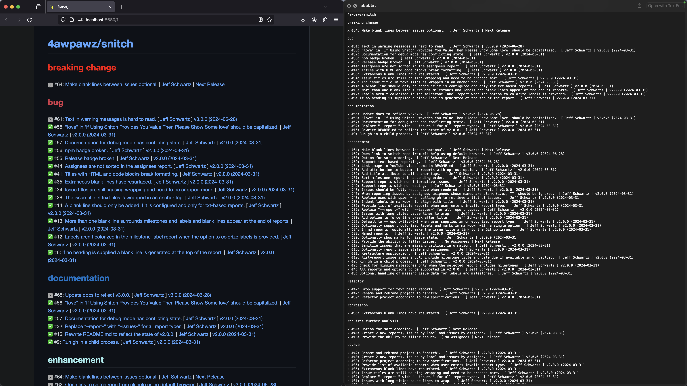
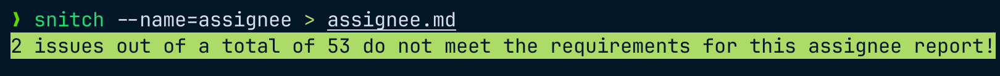
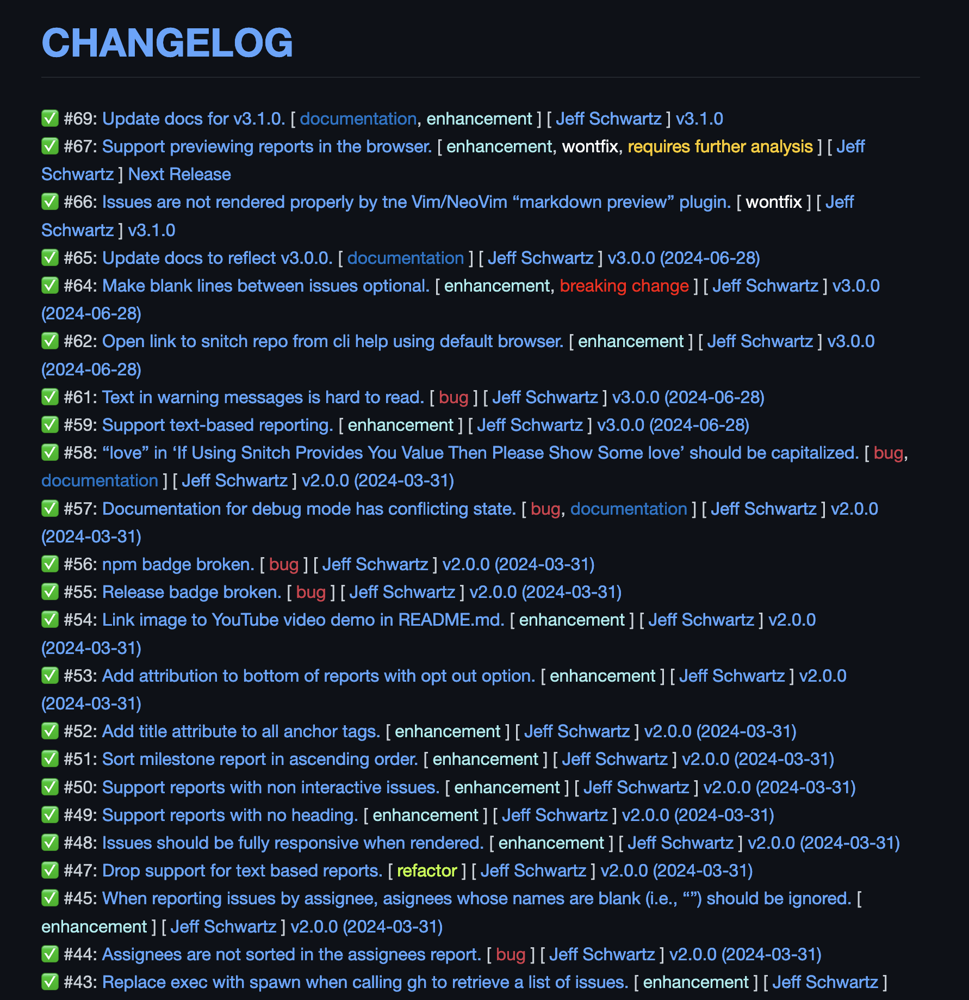

# Snitch 👉


[](https://badge.fury.io/js/@4awpawz%2Fsnitch)
[](https://github.com/picocss/pico/blob/master/LICENSE.md)
[](https://twitter.com/4awpawz)

## Automated GitHub Issues Reporting

Five different report styles to chose from in either markdown or plain text.



⚠️ This project was formerly named _ghif_ but as of v2 has diverged significantly enough from that codebase to warrant rebranding while maintaining all its previous git history.

## What's New

- Snitch v3.2.0 adds support for overriding how issues, labels, assignees, and milestones are sorted, giving you even greater control over how you tailor your reports. See [Options](#options) below for details.
- Snitch v3.1.0 added support for filtering issues by label, by assignee and by milestone. See [Options](#options) below for details.

## Installation

⚠️ Snitch requires [GitHub CLI ](https://cli.github.com) and [Node.js](https://nodejs.org/en).

To install Snitch with NPM, please run the following command in your terminal:

```shell
> npm i -g 4awpawz/snitch
```

## 5 Reports To Chose From

| Report Name | Description | Example |
| :-- | :-- | :-- |
| assignee | a list of issues by assignee | `> snitch --name=assignee > snitch-report.md` | 
| label | a list of issues by label | `> snitch --name=label > snitch-report.md` | 
| list | a list of issues | `> snitch --name=list > snitch-report.md` |
| milestone | a list of issues by milestone | `> snitch --name=milestone > snitch-report.md` |
| milestone-label | a list of issues by milestone and label | `> snitch --name=milestone-label > snitch-report.md` |

## Options

| Option | Description | Default (if omitted)| Example |
| :-- | :-- | :-- | :-- |
| --name=[list \| milestone \| milestone-label \| label \| assignee] | name of report to generate | list | `--name=milestone-label` |
| --repo=[path to repository] | path to Github repository | the GitHub repository associated with the current project determined by git remote origin | `--repo=4awpawz/snitch` |
| --as-text (v3.0.0) | output report as plain text | output report as markdown | `--as-text` |
| --heading=[report heading] | the heading for the report | repository name | `--heading=CHANGELOG` |
| --no-heading (v3.0.0) | omit heading | include heading | `--no-heading` |
| --blank-lines (v3.0.0) | seperate issues with a blank line | no seperating blank line | `--blank-lines` |
| --non-interactive | for markdown reports only, generate non interactive issues | generate interactive issues | `--non-interactive` |
| --no-attribution | attribution is jnot appended to the report | attribution is appended to the report | `--no-attribution` |
| --max-issues=integer | maximum number of issues to report | 10000 | `--max-issues=100000` |
| --state=[all \| open \| closed] | filter  issues by state | all | `--state=closed` |
| --label=\<strings\> (v3.1.0) | filter issues by one or more labels | no filtering by label | `--label=bug` |
| --assignee=\<string\> (v3.1.0) | filter issues by assignee | no filtering by assignee | `--assignee=supercoder` |
| --milestone=\<string\> (v3.1.0) | filter issues by milestone | no filtering by milestone | `--milestone=v10.6.20` |
| --sort-issues-ascending (v3.2.0) | sort issues in reverse order, see [below](#sorting) for details | the default sort order is descending | `--sort-issues-ascending` |
| --sort-labels-descending (v3.2.0) | sort labels in reverse order, see [below](#sorting) for details  | the default sort order is ascending | `--sort-labels-descending` |
| --sort-assignees-descending (v3.2.0) | sort assigness in reverse order, see [below](#sorting) for details  | the default sort order is ascending | `--sort-assignees-descending` |
| --sort-milestones-descending (v3.2.0) | sort milestones in reverse order, see [below](#sorting) for details  | the default sort order is ascending | `--sort-milestones-descending` |
| --debug | run in debug mode, see [below](#debug-mode) for details | run in normal mode | `--debug` |

## Saving output to a file

Use redirection (i.e., `>`) to save output to a file:

```shell
> snitch --name=list > list.md
```
## Sorting

The table below lists the sort ordering options available for each report:

| Report | Applicable |
| :-- | :-- |
| list | --sort-issues-ascending |
| milestone | --sort-issues-ascending, --sort-milestones-descending |
| milestone-label | --sort-issues-ascending, --sort-milestones-descending, --sort-labels-descending |
| assignee | --sort-issues-ascending, --sort-assignees-descending |
| label | --sort-issues-ascending, --sort-labels-descending |

## Debug mode

You can run Snitch in __debug mode__ to expose the dynamically generated configuration data that would be used during the processing of the payload returned from __GitHub's CLI__ utility as well as the command line that would be used to invoke __GitHub CLI__ itself. This information would be useful when submitting an issue or for your own problem resolution.

To invoke debug mode, append `--debug` to the command line that you would use to generate your desired report, such as the __list report__ in the command below:

```shell
> snitch --name=list --debug 
```

The output from running Snitch in debug mode would look similar to the following:

```shell
debug config:  {
  reportName: 'list',
  repo: 'https://github.com/4awpawz/snitch',
  state: 'all',
  maxIssues: 10000,
  nonInteractive: false,
  noHeading: false,
  heading: '4awpawz/snitch',
  debug: true,
  noAttribution: false,
  asText: false,
  blankLines: false,
  label: '',
  assignee: '',
  milestone: '',
  sortIssuesAscending: false,
  sortMilestonesDescending: false,
  sortAssigneesDescending: false,
  sortLabelsDescending: false
}
debug gh command:  gh issue list -L 10000 --state all --json 'number,title,labels,milestone,state,assignees,url' -R https://github.com/4awpawz/snitch
```

You can also run the _debug gh command_ to examine the JSON payload returned by GitHub's _gh_ utility:

```shell
> gh issue list -L 10000 --state all --json 'number,title,labels,milestone,state,assignees,url' -R https://github.com/4awpawz/snitch
```

## Report Sensitivity

When generating a report other than the list report you might see a warning message like the one below. It is informing you that some issues were excluded from the report because they didn't meet the report's requirements. For example, if you generate a milestone report and there are issues that haven't been assigned a milestone then those issues will be excluded from the report.



## Screencasts & Tutorials

[](https://www.youtube.com/watch?v=CgvFShjjClY)
[](https://www.youtube.com/watch?v=_vUUfBxtSFE)
[](https://www.youtube.com/watch?v=u-7oJJUUdGs)

### Example - Easily Create Your Project's Changelog

`> snitch --name=list --state=closed --heading=CHANGELOG`


<br>
<br>

<!---->
<!-- ### List Report -->
<!---->
<!-- `> snitch --name=list` -->
<!---->
<!--  -->
<!-- <br> -->
<!-- <br> -->
<!---->
<!-- ### Milestone Report -->
<!---->
<!-- `> snitch --name=milestone` -->
<!---->
<!--  -->
<!-- <br> -->
<!-- <br> -->
<!---->
<!-- ### Milestone-Label Report -->
<!---->
<!-- `> snitch --name=milestone-label` -->
<!---->
<!--  -->
<!-- <br> -->
<!-- <br> -->
<!---->
<!-- ### Label Report -->
<!---->
<!-- `> snitch --name=label` -->
<!---->
<!--  -->
<!-- <br> -->
<!-- <br> -->
<!---->
<!-- ### Assignee Report -->
<!---->
<!-- `> snitch --name=assignee` -->
<!---->
<!--  -->
<!-- <br> -->
<!-- <br> -->

## Request a new report format

Have an idea for a report format that is not yet supported? Then by all means [please submit a request](https://github.com/4awpawz/snitch/issues) and provide a detailed description of the report you are seeking.

## Known Issues

If you are a Vim or a Neovim user and you are using the _markdown-preview_ plugin to preview markdown then please be aware that it can render markdown incorrectly. Unfortunately, the plugin doesn't currently seem to be actively maintained. For more information, [please see this issue](https://github.com/iamcco/markdown-preview.nvim/issues/681).

## License

MIT

## If Using Snitch Provides You Value Then Please Show Some Love ❤️

<a href="https://www.buymeacoffee.com/4awpawz"></a>

Please 👀 watch and leave us a 🌟 star :)
